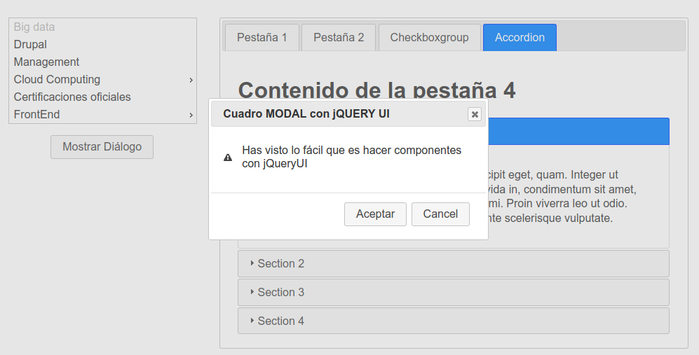

## Parte IX.2. jQuery I (Componentes)

**jQuery UI** nos proporciona muchos componentes pero antes de conocerlos y de empezar a trabajar con ellos vamos a definir qué es un componente:

### Definición de componente

> **Componente:** son elementos web que son **comunes** y que constan de una **estructura** HTML, de unos **estilos** CSS y de un **comportamiento** normalmente definido mediante javaScript. Además, están bien documentados y preparados para ser reutilizados. En definitiva son **"plantillas"** de elementos web.

### Lista de componentes de jQuery UI.

La lista de componentes de jQuery es la siguiente:

- Acordeón. <---
- Autocompletado.
- Botones. <---
- Checkboxradio. <---
- Controlgroup.
- DatePicker.
- Dialog.<---
- Menú.<---
- ProgressBar.
- SelectMenu.
- Slider.
- Spinner.
- Tabs.<---
- Tooltips.

Todos estos componentes tienen un montón de opciones, un montón de métodos y un montón de eventos propios. Podríamos dedicar un curso completo a **jQeuryUI** pero en este apartado vamos a ver únicamente algunas de las opciones (las más básicas) y algunos de los componentes (los que están señalados más arriba).

### Algunos ejemplos de componentes:

En todos los casos el flujo de trabajo que vamos a utilizar será similar al siguiente:

1. Seleccionaremos el componente que queremos usar.
2. Iremos a la opción por defecto del componente.
3. Veremos la fuente del ejemplo (View Source), copiaremos y pegaremos el HTML del ejemplo y lo retocaremos para adaptarlo a nuestras necesidades.
4. En caso de necesitar algo más revisaremos las opciones del API de cada componente.

Pretendemos obtener un resultado similar al siguiente:

Repositorio del Curso de jQuery por @pekechis para @OpenWebinars
